# ✉바이트

<p align="center"></p>

바이트는 데이터 처리, 저장, 전송의 기본적인 단위로 널리 사용되며, 이러한 개념이 이벤트 처리, 저장, 전송과 관련된 기능을 통합한 VITE 플랫폼과 유사하게 연결됩니다. 또한, 초대하다는 의미를 가진 INVITE에서 VITE를 채용함으로써, 두 가지 의미를 동시에 담고 있습니다.

### 🐕‍🦺 팀명 : 사고뭉치

### 🐶 팀원

<div align="center">
    
|[박고은](https://github.com/goeunpark123) | [배성민](https://github.com/mini-xi) | [이예원](https://github.com/onelee521) | [장민석](https://github.com/ms1011) | [정우진](https://github.com/Wrinkk) | [한소혜](https://github.com/Sosohy)|
|------------------------------------------|--------------------------------------|------------------------------------------|-----------------------------------|-------------------------------------|------------------------------------------|

</div>

## 🎈 프로젝트 개요

### 1. 프로젝트 소개

바이트는 이벤트에 대한 `초대장 발송 서비스`를 제공하는 플랫폼입니다.  이벤트 정보를 담은 초대장을 원하는 디자인의 템플릿으로 게스트들에게 이메일 또는 SMS로 전송하고, 이벤트 페이지를 통해 소통할 수 있습니다. 특별한 날을 기념하여 호스트가 원하는 선물을 등록할 경우, 게스트들이 펀딩 형식으로 선물을 구매할 수도 있습니다. 특별한 날을 더욱 특별하게 만들어줄 초대장을 통해 기억에 남을 즐거운 이벤트를 진행할 수 있습니다.

### 2. 프로젝트 필요성

멀리 사는 지인에게 평범한 이메일이나 문자가 아닌 특별한 초대장을 보낼 수 있습니다.

<p align="center"></p>
<p align="center"></p>
<p align="center"></p>


최근 뉴스에 따르면 모바일 초대장이 개인 행사뿐만 아니라 지역 행사나 회사에서도 널리 사용되고 있습니다. 모임 통장의 보편화로 소규모 모임이 늘어나고 있으며, 연말, 연시 등 다양한 개인 및 인간 관계의 기념일이 다양화되고 있어서 초대장의 역할이 더욱 중요해졌습니다.

초대장 발송은 더 이상 단순한 의사소통 수단을 넘어서 새로운 경험의 수단으로 강조되고 있습니다. 이러한 흐름에 따라 초대장은 모임의 품질을 높일 수 있는 방안으로 강조되고 있습니다. 초대장을 통해 이벤트 참여자들과 소통할 수 있는 커뮤니티 기능이나 선물 교환 기능 등을 활용하면, 초대장이 단순한 통보 수단에서 벗어나 상호작용의 중심지로서 강조될 수 있습니다. 이는 사용자들에게 참여 동기를 부여하고, 이벤트 참여와 즐거움 공유의 기회를 제공합니다.

초대장은 이제 행사의 시작점에 머물러 있지 않고, 새로운 인연의 시작을 의미하는 중요한 역할을 합니다. 이에 따라, 미래에는 더 다양하고 흥미로운 초대장 서비스의 등장이 기대되고 있습니다.

</aside>

### 3. 프로젝트 주요 기능

1. 이벤트 초대하기/RSVP(초대 확인)
    - 이메일 또는 전화번호로 다른 사람에게 이벤트를 발송한다.
    - 초대받은 게스트는 이벤트 정보를 확인하고 참석 여부를 등록할 수 있다.
    - 이벤트의 호스트와 초대받은 회원은 이벤트 페이지에서 댓글을 통해 소통할 수 있다.

2. 초대장템플릿 구매/적용
    - 회원은 이벤트에 적용할 초대장템플릿을 구매할 수 있다.
    - 이벤트 생성 시, 호스트는 보유한 템플릿을 이벤트에 적용할 수 있다.

3. 선물/펀딩
    - 호스트는 이벤트에 받고 싶은 선물을 등록할 수 있다.
    - 회원인 게스트들은 호스트가 등록한 선물에 원하는 만큼 결제하여 선물할 수 있다.

4. 다른 이벤트 확인하기
    - 이벤트 공유 페이지를 통해 다른 사람의 이벤트를 참고할 수 있다.
    - 현재 인기가 많은 이벤트 형식이 무엇인지 확인할 수 있다.

## 📟 기술스택
<div align="center">

|DA#|ubuntu|mariaDB|
|---|---|---|
||||   

</div>

## 📝 WBS

<p align="center"></p>

## 📘 요구사항

<details>
<summary><b>VITE 상세정책</b></summary>
    
- 회원등급 관련
    - 일반: 할인 혜택 없음
    - VIP : 3% 할인 (누적결제금액 3만원 이상)
    - VVIP : 5% 할인 (누적결제금액  5만원 이상)
    - 운영자
    
- 운영자 권한
    - 회원의 게시물 및 댓글 수정/삭제
    - 회원 관리 및 계정 정지
    - 공지사항 작성
    - 문의사항 답변
    - 초대장 템플릿 등록
    
- 회원 권한
    - 이벤트/이벤트댓글/게시글 작성
    - 이벤트 초대 받기/RSVP
    - 선물 결제
    - 템플릿 결제
    
- 비회원 권한
    - 이벤트 초대 받기/RSVP
    
- 결제 및 환불 관련 정책
    - 템플릿 환불
        - 템플릿 사용 전 환불 100%
        - 템플릿 사용 후 환불 불가
    - 선물 펀딩 환불
        - 금액을 달성하지 못하면 참여 게스트 전액 환불(은행API의 기능)
    - 선물 펀딩 성공 시
        - 호스트에게 모인 금액 전송(은행API의 기능)
</details>

<p align="center"></p>


## 💭 DB 모델링

### 1. 개념 모델링
<p align="center"></p>

### 2. 논리 모델링(Barker 표기법)
<p align="center"></p>
<details>
<summary><b>논리모델링 확대(L/R)</b></summary>
(L)
<p align="center"></p>
(R)
<p align="center"></p>
</details>

### 3. 물리 모델링
<p align="center"></p>
<details>
<summary><b>물리모델링 확대(L/R)</b></summary>
(L)
<p align="center"></p>
(R)
<p align="center"></p>
</details>

## 📖 DDL
<details>
<summary><b>VITE DDL</b></summary>
    
```
-- 이벤트(event) 테이블 생성
CREATE TABLE `event` (
    `event_id`  INT NOT NULL AUTO_INCREMENT PRIMARY KEY COMMENT '이메일 형식',             -- 이벤트ID
    `event_title`   VARCHAR(100)    NOT NULL,                                           -- 이벤트제목
    `event_date`    DATETIME    NOT NULL,                                               -- 시작날짜및시간
    `event_place`   VARCHAR(30),                                                        -- 장소
    `dress_code`    VARCHAR(20),                                                        -- 드레스코드
    `event_contents`    TEXT,                                                           -- 이벤트내용
    `event_category_id` INT NOT NULL COMMENT '이벤트카테고리의 카테고리ID',                    -- 카테고리ID
    `user_id`   VARCHAR(50) NOT NULL COMMENT '회원의 회원ID',                              -- 회원ID(호스트)
    `invitation_template_id`    INT NOT NULL COMMENT '초대장템플릿의 초대장템플릿ID',           -- 초대장템플릿ID
    `is_public` BOOLEAN NOT NULL    DEFAULT false   COMMENT 'true(공개), false(비공개)',   -- 이벤트공개여부
    `event_like_cnt`    INT NOT NULL    DEFAULT 0,                                      -- 좋아요수
    `event_delete`  BOOLEAN NOT NULL    DEFAULT false                                   -- 이벤트삭제여부
);

-- 이벤트댓글(comment) 테이블 생성
CREATE TABLE `comment` (
    `comment_id`    INT NOT NULL AUTO_INCREMENT PRIMARY KEY,        -- 이벤트댓글ID
    `comment_contents`  TEXT    NOT NULL,                           -- 댓글내용
    `comment_time`  DATETIME DEFAULT CURRENT_TIMESTAMP NOT NULL,    -- 댓글작성시간
    `event_id`  INT NOT NULL COMMENT '이벤트의 이벤트ID',               -- 이벤트ID
    `user_id`   VARCHAR(50) NOT NULL COMMENT '회원의 회원ID',          -- 회원ID
    `image_id`  INT COMMENT '이미지의 이미지ID',                        -- 이미지ID
    `comment_delete`    BOOLEAN NOT NULL    DEFAULT false           -- 댓글삭제여부
);

-- 결제(payment) 테이블 생성
CREATE TABLE `payment` (
    `payment_id`    INT NOT NULL AUTO_INCREMENT PRIMARY KEY,                    -- 결제ID
    `payment_date`  DATETIME    NOT NULL DEFAULT CURRENT_TIMESTAMP(),           -- 결제일자
    `payment_amount`    INT NOT NULL    DEFAULT 0,                              -- 결제금액
    `payment_method`    VARCHAR(30) NOT NULL    COMMENT '카드, 무통장입금 등',       -- 결제수단
    `user_id`   VARCHAR(50) NOT NULL COMMENT '회원의 회원ID'                       -- 회원ID
);

-- 초대장템플릿(invitation_template) 테이블 생성
CREATE TABLE `invitation_template` (
    `invitation_template_id`    INT NOT NULL AUTO_INCREMENT PRIMARY KEY,    -- 초대장템플릿ID
    `invitation_template_name`  VARCHAR(100)    NOT NULL UNIQUE,            -- 초대장템플릿이름
    `invitation_font`   VARCHAR(30) NOT NULL,                               -- 초대장글씨체
    `invitation_price`  INT NOT NULL    DEFAULT 0,                          -- 초대장가격
    `image_id`  INT NOT NULL COMMENT '회원의 회원ID',                          -- 이미지ID
    `invitation_like_cnt`   INT NOT NULL    DEFAULT 0,                      -- 좋아요수
    `template_delete`   BOOLEAN NOT NULL    DEFAULT false                   -- 초대장템플릿삭제여부
);

-- 선물(present) 테이블 생성
CREATE TABLE `present` (
    `present_id`    INT NULL AUTO_INCREMENT PRIMARY KEY,                            -- 선물ID
    `present_name`  VARCHAR(100)    NOT NULL,                                       -- 선물이름
    `present_price` INT NOT NULL,                                                   -- 선물가격
    `present_total` INT NOT NULL    DEFAULT 0   COMMENT '게스트들이 결제해서 모인 돈',     -- 모인금액
    `event_id`  INT NOT NULL COMMENT '이벤트의 이벤트ID',                               -- 이벤트ID
    `present_delete`    BOOLEAN NOT NULL    DEFAULT false                           -- 선물삭제여부
);

-- 회원등급(grade) 테이블 생성
CREATE TABLE `grade` (
    `grade_name`    VARCHAR(10) NOT NULL    DEFAULT '일반' COMMENT 'VIP/VVIP 등',  -- 등급이름
    `grade_benefit` VARCHAR(1000)   NOT NULL,                                    -- 등급혜택
    `grade_standard`    INT NOT NULL    COMMENT '총 결제 금액에 따른 회원 등급 구분'      -- 금액기준
);

-- 이벤트카테고리(event_category) 테이블 생성
CREATE TABLE `event_category` (
    `event_category_id` INT NOT NULL AUTO_INCREMENT PRIMARY KEY,    				  -- 카테고리ID
    `event_category_type`   VARCHAR(20) NOT NULL,                   				  -- 카테고리종류
    `is_personal`   BOOLEAN NOT NULL    DEFAULT true COMMENT 'true(비공개), false(공개)' -- 상세구분
);

-- 게스트명단(guest_list) 테이블 생성
CREATE TABLE `guest_list` (
    `guest_id`  INT NOT NULL AUTO_INCREMENT PRIMARY KEY,                                    -- 게스트ID
    `guest_email`   VARCHAR(50),                                                            -- 이메일
    `guest_phone`   VARCHAR(13),                                                            -- 전화번호
    `is_attended`   BOOLEAN NOT NULL    DEFAULT false COMMENT 'true(참석), false(불참)',      -- 참석여부
    `send_time` DATETIME    DEFAULT CURRENT_TIMESTAMP NOT NULL,                             -- 이벤트발송시간
    `is_send`   BOOLEAN NOT NULL    DEFAULT false COMMENT 'true(발송성공), false(발송실패)',    -- 이벤트발송성공여부
    `event_id`  INT NOT NULL COMMENT '이벤트의 이벤트ID'                                       -- 이벤트ID
);

-- 선물결제(present_payment) 테이블 생성
CREATE TABLE `present_payment` (
    `payment_id`    INT NOT NULL COMMENT '결제의 결제ID',    -- 결제ID
    `present_id`    INT NOT NULL COMMENT '선물의 선물ID'     -- 선물ID
);

-- 초대장결제(invitation_payment) 테이블 생성
CREATE TABLE `invitation_payment` (
    `payment_id`    INT NOT NULL,                                                        -- 결제ID
    `invitation_template_id`    INT NOT NULL COMMENT '초대장템플릿의 초대장템플릿ID',            -- 초대장템플릿ID
    `is_available`  BOOLEAN NOT NULL DEFAULT TRUE COMMENT 'true(사용가능), false(사용불가)'   -- 사용가능여부
);

-- 환불(refund) 테이블 생성
CREATE TABLE `refund` (
    `refund_id` INT NOT NULL AUTO_INCREMENT PRIMARY KEY,                        -- 환불ID
    `refund_state`  VARCHAR(30) NOT NULL    DEFAULT '신청'    COMMENT '신청/완료',  -- 환불상태
    `refund_request_date`   DATETIME    NOT NULL DEFAULT CURRENT_TIMESTAMP,     -- 환불신청날짜
    `refund_complete_date`  DATETIME,                                           -- 환불완료날짜
    `payment_id`    INT NOT NULL COMMENT '결제의 결제ID'                           -- 결제ID
);

-- 회원별초대내역(user_invite) 테이블 생성
CREATE TABLE `user_invite` (
    `event_id`  INT NOT NULL COMMENT '이벤트의 이벤트ID',                                          -- 이벤트ID
    `user_id`   VARCHAR(50) NOT NULL COMMENT '회원의 회원ID',                                     -- 회원ID
    `is_invited`    BOOLEAN NOT NULL    DEFAULT false   COMMENT 'true(초대받음), false(초대함)'    -- 초대구분
);

-- 이미지(image) 테이블 생성
CREATE TABLE `image` (
    `image_id`  INT NOT NULL AUTO_INCREMENT PRIMARY KEY,    -- 이미지ID
    `image_route`   VARCHAR(500)    NOT NULL,               -- 경로
    `image_name`    VARCHAR(100)    NOT NULL,               -- 원본이미지이름
    `image_type`    VARCHAR(30) NOT NULL                    -- 이미지구분
);

-- 이벤트좋아요관리(event_like) 테이블 생성
CREATE TABLE `event_like` (
    `event_id`  INT NOT NULL COMMENT '이벤트의 이벤트ID',      -- 이벤트ID
    `user_id`   VARCHAR(50) NOT NULL COMMENT '회원의 회원ID'  -- 회원ID
);

-- 게시글(post) 테이블 생성
CREATE TABLE `post` (
    `post_id`   INT NOT NULL    AUTO_INCREMENT PRIMARY KEY,             -- 게시글ID
    `post_title`    VARCHAR(100)    NOT NULL,                           -- 게시글제목
    `post_type` VARCHAR(10) NOT NULL    COMMENT '문의사항/공지사항',         -- 게시글유형                    
    `post_contents` TEXT    NOT NULL,                                   -- 게시글내용
    `post_date` DATETIME    NOT NULL DEFAULT CURRENT_TIMESTAMP,         -- 게시글작성일
    `report_category_id`    INT COMMENT '문의카테고리의 문의카테고리ID',        -- 문의카테고리ID
    `user_id`   VARCHAR(50) NOT NULL    COMMENT '회원의 회원ID',           -- 작성자ID
    `image_id`  INT COMMENT '이미지의 이미지ID',                            -- 이미지ID
    `post_deleted`  BOOLEAN NOT NULL    DEFAULT false                   -- 게시글삭제여부
);

-- 문의카테고리(report_category) 테이블 생성
CREATE TABLE `report_category` (
    `report_category_id`    INT NOT NULL AUTO_INCREMENT PRIMARY KEY,      -- 문의카테고리ID
    `report_type`   VARCHAR(40) NOT NULL    UNIQUE comment '스팸/욕설 등'    -- 문의종류
);

-- 초대장템플릿좋아요관리(invitation_template_like) 테이블 생성
CREATE TABLE `invitation_template_like` (
    `invitation_template_id`    INT NOT NULL COMMENT '초대장템플릿의 초대장템플릿ID',    -- 초대장템플릿ID
    `user_id`   VARCHAR(30) NOT NULL    COMMENT '회원의 회원ID'                     -- 회원ID
);

-- 회원(user) 테이블 생성
CREATE TABLE `user` (
    `user_id`   VARCHAR(50) NOT NULL    COMMENT '이메일 형식',                                   -- 회원ID
    `user_pw`   VARCHAR(20) NOT NULL,                                                         -- 비밀번호
    `user_name` VARCHAR(12) NOT NULL,                                                         -- 회원이름
    `user_phone`    VARCHAR(13) NOT NULL,                                                     -- 전화번호
    `total_price`   INT NOT NULL    DEFAULT 0   COMMENT '결제 금액에 대한 총 합',                  -- 누적결제금액
    `user_withdraw` DATETIME    NULL,                                                         -- 탈퇴일자
    `grade_name`    VARCHAR(10) NOT NULL    DEFAULT '일반회원' COMMENT '일반회원/운영자 등',         -- 등급이름
    `user_status`   VARCHAR(20) NOT NULL    DEFAULT '활성화'   COMMENT '활성화/계정정지/탈퇴 등',     -- 회원상태
    `user_nickname` VARCHAR(15) NOT NULL    UNIQUE                                            -- 닉네임
);

-- 답변(reply) 테이블 생성
CREATE TABLE `reply` (
    `reply_id`  INT NOT NULL AUTO_INCREMENT PRIMARY KEY,                    -- 답변ID
    `reply_contents`    TEXT    NOT NULL,                                   -- 답변내용
    `reply_title`   VARCHAR(100)    NOT NULL,                               -- 답변제목
    `user_id`   VARCHAR(50) NOT NULL    COMMENT '회원의 회원ID',               -- 관리자ID
    `post_id`   INT NOT NULL COMMENT '게시글의 게시글ID',                       -- 게시글ID
    `reply_deleted` BOOLEAN NOT NULL    DEFAULT false COMMENT 'true(삭제)'   -- 답변삭제여부
);


ALTER TABLE `grade` ADD CONSTRAINT `PK_GRADE` PRIMARY KEY (
    `grade_name`
);

ALTER TABLE `present_payment` ADD CONSTRAINT `PK_PRESENT_PAYMENT` PRIMARY KEY (
    `payment_id`,
    `present_id`
);

ALTER TABLE `invitation_payment` ADD CONSTRAINT `PK_INVITATION_PAYMENT` PRIMARY KEY (
    `payment_id`,
    `invitation_template_id`
);

ALTER TABLE `user_invite` ADD CONSTRAINT `PK_USER_INVITE` PRIMARY KEY (
    `event_id`,
    `user_id`
);

ALTER TABLE `event_like` ADD CONSTRAINT `PK_EVENT_LIKE` PRIMARY KEY (
    `event_id`,
    `user_id`
);

ALTER TABLE `invitation_template_like` ADD CONSTRAINT `PK_INVITATION_TEMPLATE_LIKE` PRIMARY KEY (
    `invitation_template_id`,
    `user_id`
);

ALTER TABLE `user` ADD CONSTRAINT `PK_USER` PRIMARY KEY (
    `user_id`
);

ALTER TABLE `event` ADD CONSTRAINT `FK_event_category_TO_event_1` FOREIGN KEY (
    `event_category_id`
)
REFERENCES `event_category` (
    `event_category_id`
);

ALTER TABLE `event` ADD CONSTRAINT `FK_user_TO_event_1` FOREIGN KEY (
    `user_id`
)
REFERENCES `user` (
    `user_id`
);

ALTER TABLE `event` ADD CONSTRAINT `FK_invitation_template_TO_event_1` FOREIGN KEY (
    `invitation_template_id`
)
REFERENCES `invitation_template` (
    `invitation_template_id`
);

ALTER TABLE `comment` ADD CONSTRAINT `FK_event_TO_comment_1` FOREIGN KEY (
    `event_id`
)
REFERENCES `event` (
    `event_id`
);

ALTER TABLE `comment` ADD CONSTRAINT `FK_user_TO_comment_1` FOREIGN KEY (
    `user_id`
)
REFERENCES `user` (
    `user_id`
);

ALTER TABLE `comment` ADD CONSTRAINT `FK_image_TO_comment_1` FOREIGN KEY (
    `image_id`
)
REFERENCES `image` (
    `image_id`
);

ALTER TABLE `payment` ADD CONSTRAINT `FK_user_TO_payment_1` FOREIGN KEY (
    `user_id`
)
REFERENCES `user` (
    `user_id`
);

ALTER TABLE `invitation_template` ADD CONSTRAINT `FK_image_TO_invitation_template_1` FOREIGN KEY (
    `image_id`
)
REFERENCES `image` (
    `image_id`
);

ALTER TABLE `present` ADD CONSTRAINT `FK_event_TO_present_1` FOREIGN KEY (
    `event_id`
)
REFERENCES `event` (
    `event_id`
);

ALTER TABLE `guest_list` ADD CONSTRAINT `FK_event_TO_guest_list_1` FOREIGN KEY (
    `event_id`
)
REFERENCES `event` (
    `event_id`
);

ALTER TABLE `present_payment` ADD CONSTRAINT `FK_payment_TO_present_payment_1` FOREIGN KEY (
    `payment_id`
)
REFERENCES `payment` (
    `payment_id`
);

ALTER TABLE `present_payment` ADD CONSTRAINT `FK_present_TO_present_payment_1` FOREIGN KEY (
    `present_id`
)
REFERENCES `present` (
    `present_id`
);

ALTER TABLE `invitation_payment` ADD CONSTRAINT `FK_payment_TO_invitation_payment_1` FOREIGN KEY (
    `payment_id`
)
REFERENCES `payment` (
    `payment_id`
);

ALTER TABLE `invitation_payment` ADD CONSTRAINT `FK_invitation_template_TO_invitation_payment_1` FOREIGN KEY (
    `invitation_template_id`
)
REFERENCES `invitation_template` (
    `invitation_template_id`
);

ALTER TABLE `refund` ADD CONSTRAINT `FK_payment_TO_refund_1` FOREIGN KEY (
    `payment_id`
)
REFERENCES `payment` (
    `payment_id`
);

ALTER TABLE `user_invite` ADD CONSTRAINT `FK_event_TO_user_invite_1` FOREIGN KEY (
    `event_id`
)
REFERENCES `event` (
    `event_id`
);

ALTER TABLE `user_invite` ADD CONSTRAINT `FK_user_TO_user_invite_1` FOREIGN KEY (
    `user_id`
)
REFERENCES `user` (
    `user_id`
);

ALTER TABLE `event_like` ADD CONSTRAINT `FK_event_TO_event_like_1` FOREIGN KEY (
    `event_id`
)
REFERENCES `event` (
    `event_id`
);

ALTER TABLE `event_like` ADD CONSTRAINT `FK_user_TO_event_like_1` FOREIGN KEY (
    `user_id`
)
REFERENCES `user` (
    `user_id`
);

ALTER TABLE `post` ADD CONSTRAINT `FK_report_category_TO_post_1` FOREIGN KEY (
    `report_category_id`
)
REFERENCES `report_category` (
    `report_category_id`
);

ALTER TABLE `post` ADD CONSTRAINT `FK_user_TO_post_1` FOREIGN KEY (
    `user_id`
)
REFERENCES `user` (
    `user_id`
);

ALTER TABLE `post` ADD CONSTRAINT `FK_image_TO_post_1` FOREIGN KEY (
    `image_id`
)
REFERENCES `image` (
    `image_id`
);

ALTER TABLE `invitation_template_like` ADD CONSTRAINT `FK_invitation_template_TO_invitation_template_like_1` FOREIGN KEY (
    `invitation_template_id`
)
REFERENCES `invitation_template` (
    `invitation_template_id`
);

ALTER TABLE `invitation_template_like` ADD CONSTRAINT `FK_user_TO_invitation_template_like_1` FOREIGN KEY (
    `user_id`
)
REFERENCES `user` (
    `user_id`
);

ALTER TABLE `user` ADD CONSTRAINT `FK_grade_TO_user_1` FOREIGN KEY (
    `grade_name`
)
REFERENCES `grade` (
    `grade_name`
);

ALTER TABLE `reply` ADD CONSTRAINT `FK_user_TO_reply_1` FOREIGN KEY (
    `user_id`
)
REFERENCES `user` (
    `user_id`
);

ALTER TABLE `reply` ADD CONSTRAINT `FK_post_TO_reply_1` FOREIGN KEY (
    `post_id`
)
REFERENCES `post` (
    `post_id`
);
```
</details>

## ✒️ 주요 쿼리

## 📃 테스트케이스 문서

## 🏁 테스트케이스 
<details>
<summary><b>🕵️‍♀️회원</b></summary>
    <div>
         <details>
         <summary><b>1. 회원가입</b></summary>
         <p>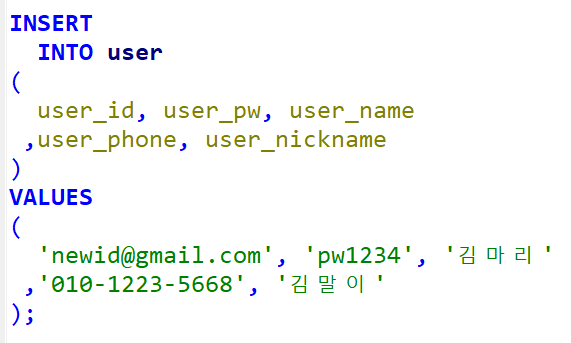</p>
	 <p>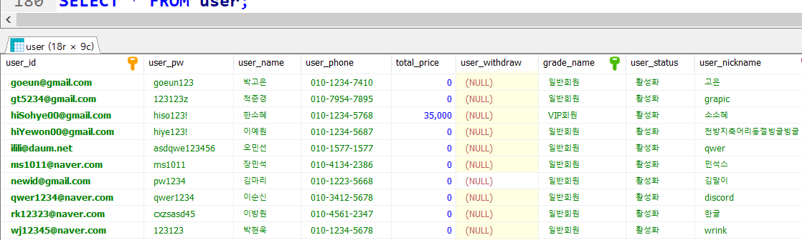</p>
         </details>
	 <details>
         <summary><b>2. 비밀번호 찾기</b></summary>
         <p>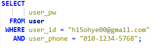</p>
	 <p>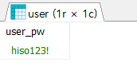</p>
         </details>
	 <details>
         <summary><b>3. 회원정보 수정</b></summary>
         <p>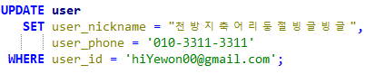</p>
	 <p></p>
         </details>
	 <details>
         <summary><b>4. 회원 탈퇴</b></summary>
         <p>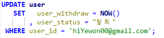</p>
	 <p>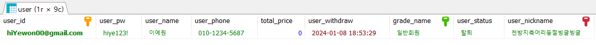</p>
         </details>
	 <details>
         <summary><b>5. 초대 내역 확인</b></summary>
         <p>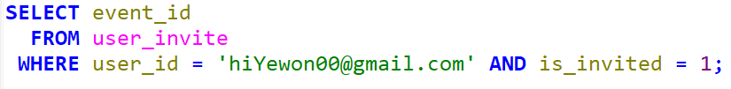</p>
         <p>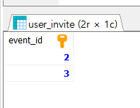</p>
	 <p>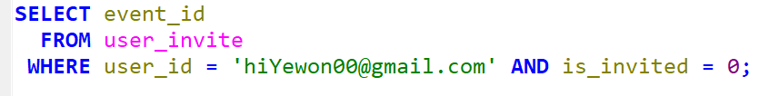</p>
	 <p>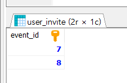</p>
         </details>
	 <details>
         <summary><b>6. 회원 상태 관리</b></summary>
         <p></p>
	 <p>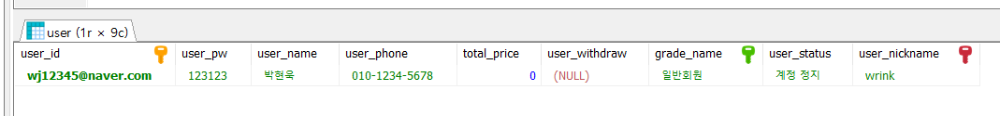</p>
         </details>
	 <details>
         <summary><b>7. 회원ID 검색</b></summary>
         <p>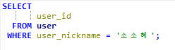</p>
	 <p>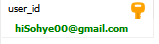</p>
         </details>				 
	 <details>
         <summary><b>8. 닉네임 검색</b></summary>
         <p>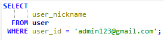</p>
	 <p>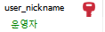</p>
         </details>
    </div>
</details>

***
<details>
<summary><b>✨이벤트</b></summary>
	<div>
         <details>
         <summary><b>1. 이벤트 삭제</b></summary>
         <p>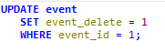</p>
         <p>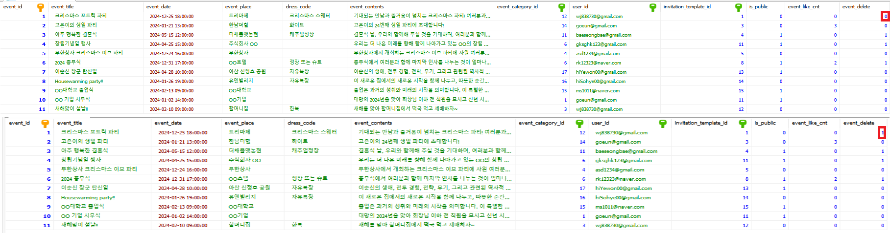</p>
         </details>
         <details>
         <summary><b>2. 이벤트 공개</b></summary>
         <p>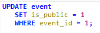</p>
         <p>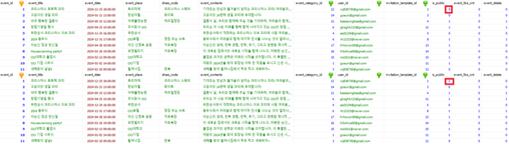</p>
         </details>
         <details>
         <summary><b>3. 이벤트 비공개</b></summary>
         <p>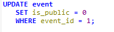</p>
         <p>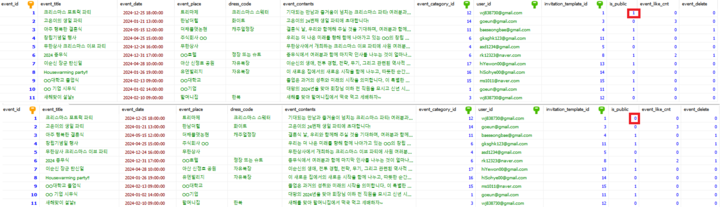</p>
         </details>
         <details>
         <summary><b>4. 이벤트 좋아요</b></summary>
         <p>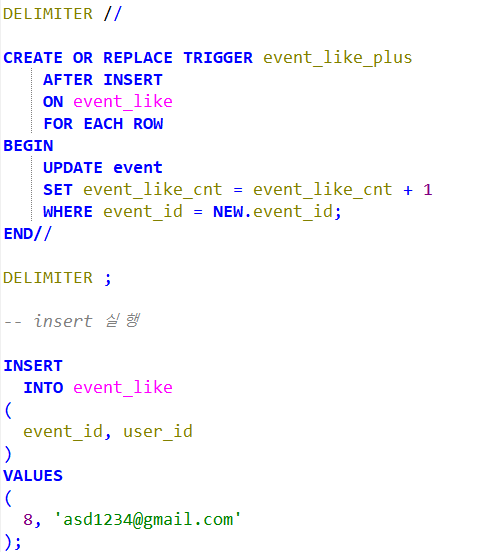</p>
         <p>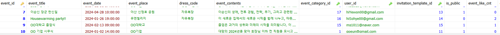</p>
         </details>
         <details>
         <summary><b>5. 이벤트 좋아요 취소</b></summary>
         <p>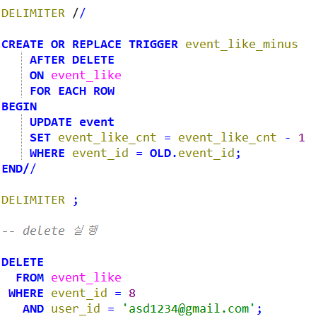</p>
         <p>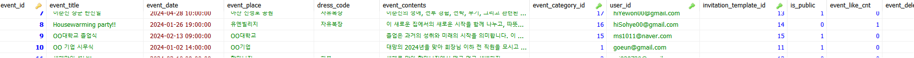</p>
         </details>
         <details>
         <summary><b>6. 이벤트 댓글 작성</b></summary>
         <p>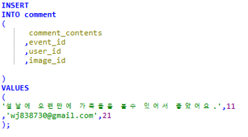</p>
         <p>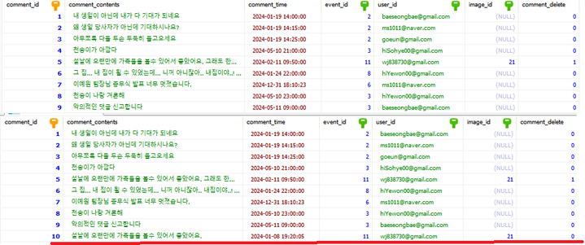</p>
         </details>
         <details>
         <summary><b>7. 이벤트 댓글 수정</b></summary>
         <p>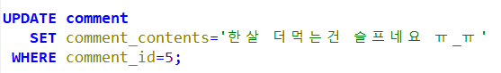</p>
         <p>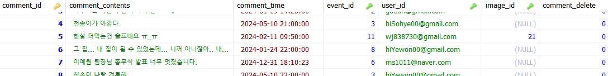</p>
         </details>
         <details>
         <summary><b>8. 이벤트 댓글 삭제</b></summary>
         <p>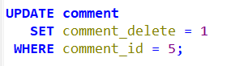</p>
         <p></p>
         </details>
         <details>
         <summary><b>9. 이벤트 좋아요</b></summary>
         <p></p>
         <p></p>
         </details>
	 <details>
         <summary><b>10. 회원별 작성 이벤트 댓글 조회</b></summary>
         <p>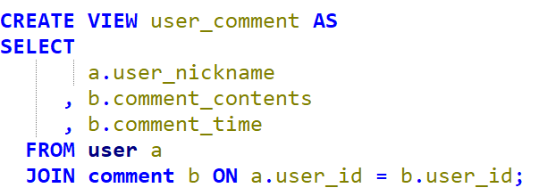</p>
         <p>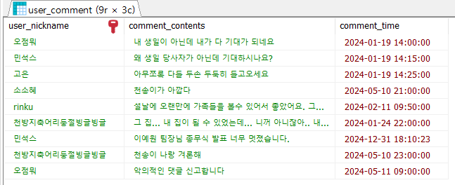</p>
         </details>
	 <details>
         <summary><b>11. 이벤트 주최 회원 닉네임 확인</b></summary>
         <p>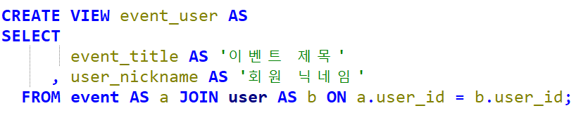</p>
         <p>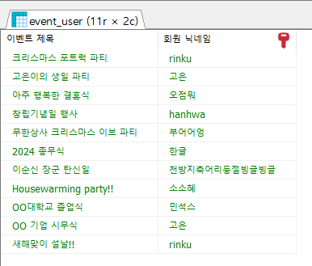</p>
         </details>
	 <details>
         <summary><b>12. 이벤트카테고리별 이벤트 목록 확인</b></summary>
         <p></p>
         <p>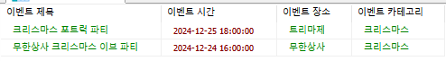</p>
         </details>
    </div>
</details>

***
<details>
<summary><b>💸결제</b></summary>
    <div>
	 <details>
         <summary><b>1. 결제하기</b></summary>
         <p>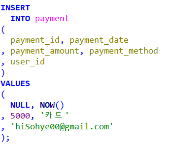</p>
         <p>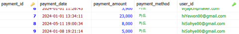</p>
         </details>
	 <details>
         <summary><b>2. 결제내역 확인</b></summary>
         <p>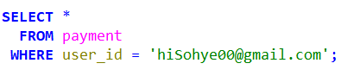</p>
         <p>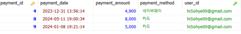</p>
         </details>
    </div>
</details>

***
<details>
<summary><b>💱환불</b></summary>
    <div>
         <details>
         <summary><b>1. 환불 신청</b></summary>
         <p>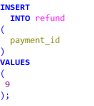</p>
	 <p>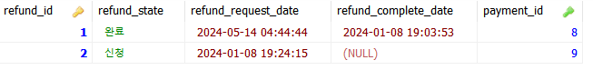</p>
         </details>
         <details>
         <summary><b>2. 환불 완료</b></summary>
         <p>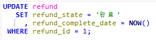</p>
	 <p></p>
         </details>
         <details>
         <summary><b>3. 환불내역 확인</b></summary>
         <p>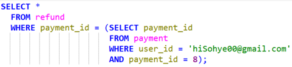</p>
	 <p></p>
         </details>
         <details>
         <summary><b>4. 초대장템플릿별 환불내역 확인</b></summary>
         <p>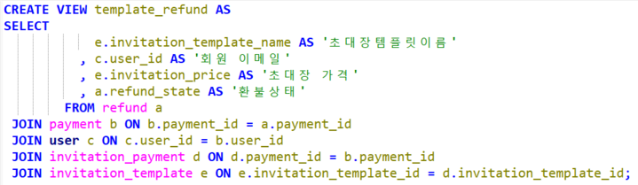</p>
	 <p>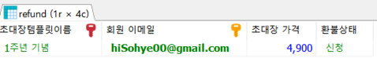</p>
         </details>
         <details>
         <summary><b>5. 선물별 환불 내역 확인</b></summary>
         <p>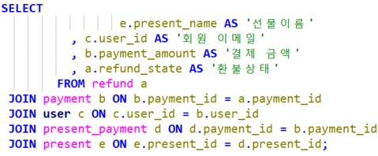</p>
	 <p>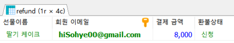</p>
         </details>
    </div>
</details>

***

<details>
<summary><b>📮초대장템플릿</b></summary>
    <div>
         <details>
         <summary><b>1. 초대장템플릿 업로드</b></summary>
             <p></p>
             <p></p>
        </details>
        <details>
        <summary><b>2. 초대장템플릿 검색</b></summary>
             <p>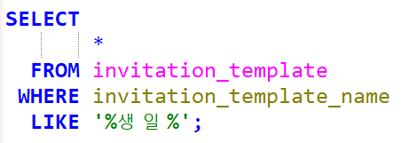</p>
             <p>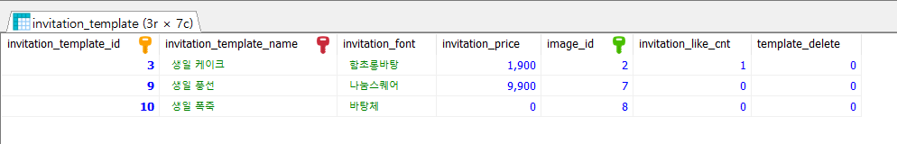</p>
        </details>
        <details>
        <summary><b>3. 초대장템플릿 구매가능 조회</b></summary>
             <p></p>
             <p></p>
        </details>
        <details>
        <summary><b>4. 초대장템플릿 목록확인</b></summary>
             <p></p>
             <p></p>
        </details>
        <details>
        <summary><b>5. 초대장템플릿 삭제</b></summary>
             <p></p>
             <p></p>
        </details>
        <details>
        <summary><b>6. 초대장템플릿 수정</b></summary>
             <p></p>
             <p></p>
        </details>
        <details>
        <summary><b>7. 초대장템플릿 좋아요</b></summary>
             <p></p>
             <p></p>
        </details>
        <details>
        <summary><b>8. 초대장템플릿 좋아요취소</b></summary>
             <p></p>
             <p></p>
        </details>
        <details>
        <summary><b>9. 초대장템플릿 추천순정렬</b></summary>
             <p></p>
             <p></p>
        </details>
        <details>
      <summary><b>10. 초대장템플릿 카테고리별 조회</b></summary>
             <p></p>
             <p></p>
        </details>
</details>

***

<details>
<summary><b>🎁선물</b></summary>
    <div>
         <details>
         <summary><b>1. 선물 등록</b></summary>
             <p></p>
             <p></p>
        </details>
        <details>
        <summary><b>2. 선물 모인금액 확인</b></summary>
             <p></p>
             <p></p>
        </details>
    </div>
</details>

***
<details>
<summary><b>🗒️게스트명단</b></summary>
    <div>
         <details>
         <summary><b>1. 게스트명단 확인</b></summary>
         <p></p>
         <p></p>
         </details>
    </div>
</details>

***
<details>
<summary><b>✍️게시글</b></summary>
    <div>
         <details>
         <summary><b>1. 게시글 문의사항 작성</b></summary>
             <p></p>
             <p></p>
        </details>
        <details>
        <summary><b>2. 게시글 문의사항 수정</b></summary>
             <p></p>
             <p></p>
        </details>
        <details>
        <summary><b>3. 게시글 문의사항 답변</b></summary>
             <p></p>
             <p></p>
        </details>
        <details>
        <summary><b>4. 게시글 문의사항 답변 수정</b></summary>
             <p></p>
             <p></p>
        </details>
        <details>
        <summary><b>5. 게시글 문의사항별 답변 확인</b></summary>
             <p></p>
             <p></p>
        </details>
        <details>
        <summary><b>6. 게시글 공지사항 작성</b></summary>
             <p></p>
             <p></p>
        </details>
        <details>
        <summary><b>7. 게시글 공지사항 삭제</b></summary>
             <p></p>
             <p></p>
        </details>
        <details>
        <summary><b>8. 게시글 공지사항 수정</b></summary>
             <p></p>
             <p></p>
        </details>
</details>

## 👫 회고
|팀원&nbsp;&nbsp;&nbsp;&nbsp;&nbsp;&nbsp;&nbsp;&nbsp;|회고록|
|---:|---|
|박고은|데이터베이스를 처음부터 직접 설계하면서 데이터베이스에 대한 이해를 증진시키는 소중한 시간이었습니다. 또 이번 프로젝트를 진행하면서 팀원들과 아이디어 회의에서부터 문서화 작업까지 프로젝트의 모든 단계에 걸쳐 지속적으로 의견을 공유하고 토의하며 다양한 관점을 존중하는 데 집중했는데, 이 과정이 시간은 많이 소요되었지만 이를 통해 서로 다른 시각에서의 의견을 수용하고 통합되면서 프로젝트의 품질을 향상시킬 수 있었던 것 같고 뿐만 아니라, 팀워크와 소통 능력 향상에 도움이 되는 값진 경험이었습니다.|
|배성민|쉽게 생각할 수 있는 시스템이 아니기 때문에 개념적인 부분에서 토론이 필요한 시간이 조금 더 길었던 것 같습니다. 충분히 사용자에게 설득할 수 있는 부분과 기능이 있다고 생각했지만, 프로젝트를 진행하면서 아쉽거나 더 추가되었으면 좋겠다고 생각하게 되는 부분도 분명히 있었습니다. 특히 DB를 제작할 때 데이터가 될 값과 기능이 될 부분을 구분하는 것도 어려웠던 것 같습니다. 프로젝트 진행 중에 CRUD, 모델링, TRANSACTION, JOIN등 다양한 SQL문들을 이해하고 적용할 수 있었습니다. 팀원들이 열정적인만큼 함께 무엇이든 할 때 시간이 금방 지나갔다는 점이 좋았던 것 같습니다.|
|이예원|SW부트캠프를 시작하고 처음 진행한 프로젝트이었는데 처음엔 팀원들이 각자 진행하면서 속성이나 기능에 대한 다른 의견들로 충돌이 있었습니다. 그러나 다 같이 한 번 긴 회의를 통해 안 맞던 개념과 의견들을 맞추는 것을 통해 앞으로의 프로젝트 진행에 큰 대립 없이 진행될 수 있었습니다. 이 프로젝트를 통해 팀원들과의 협업이 가장 중요하다는 것을 알게 되었습니다. 주제선정부터 마무리까지 모든 팀원들이 빠지지 않고 참여해서 좋은 경험이었습니다.|
|장민석|아직 서로를 잘 모르는 상태에서 진행된 프로젝트는 도전적이었습니다. 상대방의 성격과 능력을 파악하지 못한 채로 시작되었기 때문에, 팀워크를 강화하기 위해 대화에 집중했습니다. 주제가 선정되고 나서도 같은 주제이지만 서로 다른 서비스 형태에 대한 의견 차이가 존재해 많은 의견 공유가 이뤄졌습니다. 대화를 통해 공통된 관심사를 찾아내며 서로의 생각을 조율할 수 있었습니다. 이러한 과정은 시간이 걸렸고 다양한 고민이 있었지만, 결과적으로 모두가 만족할 수 있는 프로젝트로 마무리되었다고 생각합니다. <br>&nbsp; 이번 프로젝트는 학생 시절의 프로젝트와는 차별화된 점이 있었습니다. 실무에서 경험할 수 있는 다양한 측면을 사전에 체험할 수 있었습니다. 이는 단순한 친구들과의 토이 프로젝트나 학교에서의 과제 제출과는 달리 WBS, 요구사항 명세서, 테스트 케이스 등 실무에서 사용되는 문서화를 경험할 수 있는 소중한 기회였습니다. 물론 회사에서는 더 체계적인 형식과 절차로 진행되겠지만, 미리 간단한 경험을 통해 실무에 대한 감각을 키울 수 있었습니다. 이러한 경험을 바탕으로 추후 프로젝트를 진행할 때 더 체계적인 문서화와 효율적인 팀 플레이를 기대해봅니다.|
|정우진|좋았던점은 데이터베이스를 처음 배우면서 새로운 도전에 대한 기대감을 느끼고, 문제를 해결하며 즐거움을 느낄 수 있었습니다. 그러나 어려움에도 불구하고 계속해서 도전하며 성장하는 과정에서 더 큰 만족감을 느낄 수 있었습니다. 아쉬운점은 학습과 적응이 예상보다 더 느리게 진행되어 자신에 대한 부족함을 많이 느꼈습니다. 그로 인해 팀원들과의 속도를 맞추기 어려웠으며, 미래에는 더 집중하고 발전하여 팀원들과의 협업에서 더 나은 성과를 이뤄내고 싶다는 욕망이 크게 느껴집니다.|
|한소혜|초반에는 팀원들끼리 같은 기능을 가지고도 다르게 생각했던 부분이 많아서 의견을 맞춰 나가는 것에 시간을 많이 쏟았지만, 초반에 시간을 쏟은 만큼 모델링을 진행할 때  더 순조롭게 진행될 수 있었다고 생각합니다. 데이터 모델링을 하면서 이론적으로만 알고 있었던 개념들을 직접 적용하고 어떤 방법이 더 나을지에 대해 고민해보면서 제가 부족한 부분들에 대해 공부할 수 있었습니다. 팀원들과 처음을 함께 하는 프로젝트인 만큼 시간적인 부분에서 효율적이지 못한 순간도 있었지만 다들 한 목표를 가지고 열심히 한 만큼 퀄리티 있는 결과물이 나올 수 있었다고 생각합니다. 다음 프로젝트에서는 팀원들과 함께 더 발전된 프로젝트 결과물을 내고 싶습니다.|


